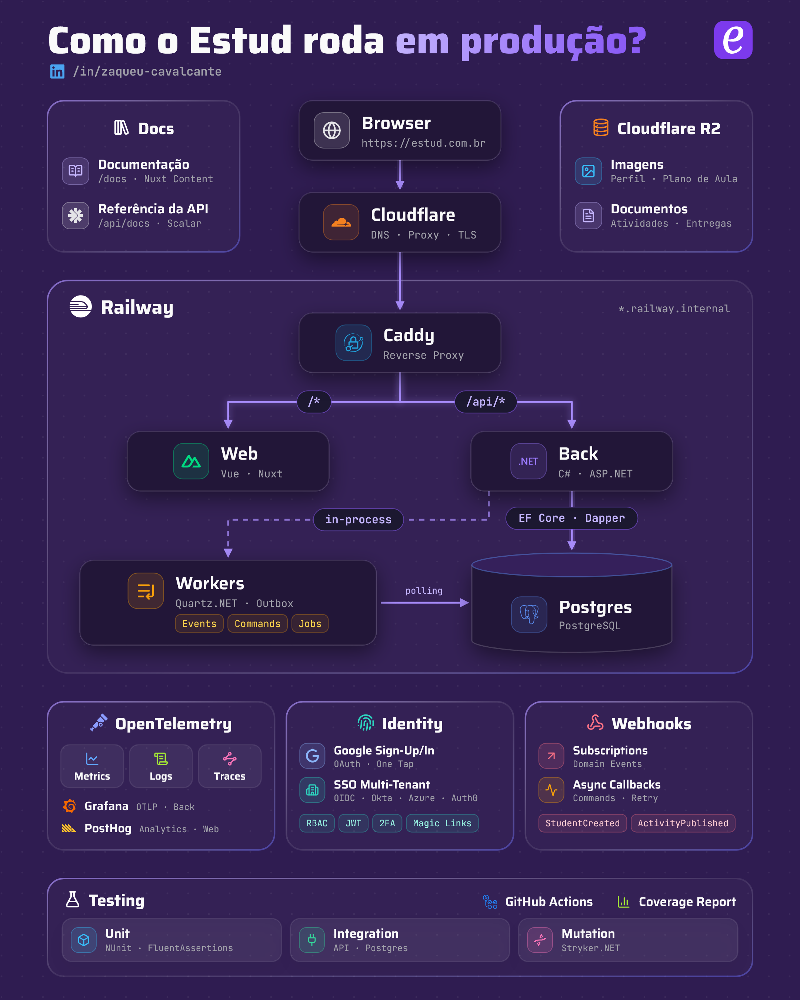

# Estud

[](https://zaqueucavalcante.github.io/estud)
[](https://zaqueucavalcante.github.io/estud)
[](https://zaqueucavalcante.github.io/estud/mutation)

O **Estud** é um sistema open-source para gestão educacional, utilizado por gestores, professores e alunos para descomplicar sua vida acadêmica.

Cadastre sua instituição de ensino em https://estud.com.br e começe a usar o Estud agora mesmo!

<picture>
  <source media="(prefers-color-scheme: dark)" srcset=".github/assets/campus-dark.svg">
  
</picture>

### Gestor

- Organiza todas as turmas, salas e horários do semestre
- Entende o desempenho real dos alunos, tanto em frequência quanto em atividades/notas
- Controla a alocação de tempo e espaço do seu campus (geral, por turno e por sala)
- Cadastra cursos, grades curriculares, ofertas de curso e períodos de matrícula
- Notifica diretamente todos os usuários da sua instituição (recados, eventos, lembretes...)
- Define perfis de acesso customizados para sua operação, com permissões granulares
- Aumenta a segurança dos seus usuários através de Single Sign-On (SSO) e Two-Factor Authentication (2FA)
- Integra facilmente o Estud à outros sistemas via webhooks e eventos assíncronos

### Professor

- Organiza seu semestre, com agenda semanal e turmas ativas
- Monta o plano de aula diretamente no sistema, com suporte nativo a Markdown
- Realiza chamadas e publica atividades nas suas turmas
- Corrige as entregas, atribui notas e dá feedbacks direto aos seus alunos

### Aluno

- Acompanha com clareza sua jornada no curso, com dados de frequência e notas
- Organiza seu semestre, com agenda semanal, turmas atuais e atividades pendentes
- Recebe notificações sobre suas turmas, atividades e entregas (+ recados da instituição)
- Sabe em detalhes seu progresso atual e aproveitamento em cada turma
- Tira dúvidas com os professores a cada entrega realizada

## Tecnologias

O projeto utiliza diversas tecnologias e conceitos de design de sistemas:

- ASP.NET, Vue.js, Postgres
- RBAC, OAuth, SSO, 2FA, Multi-Tenant
- Workers, Outbox Pattern, Webhooks
- Cloudflare, Railway, Caddy, R2
- GitHub Actions, CI/CD Pipelines
- Unit, Integration, Mutation Tests
- OpenTelemetry, Grafana, PostHog
- Full Text Search, Audit Trail
- Vertical Slice Architecture

<picture>
  <source srcset=".github/assets/estud-arch.png">
  
</picture>

## Rodando localmente

Com o Docker instalado, basta rodar na raiz do repositório:

```bash
docker compose up --build
```

Isso sobe o Postgres (já com o schema criado), o backend em http://localhost:5000 e o frontend em http://localhost:3000.

Nesse modo as integrações externas ficam desligadas (login com Google, upload de arquivos no R2 e envio de e-mails pela Brevo). Os e-mails são escritos no log do backend — para fazer o primeiro acesso, crie sua conta pelo frontend e pegue o link de acesso com:

```bash
docker compose logs back | grep magic-link
```

Ao mudar o schema do banco, recrie o volume com `docker compose down -v`.
