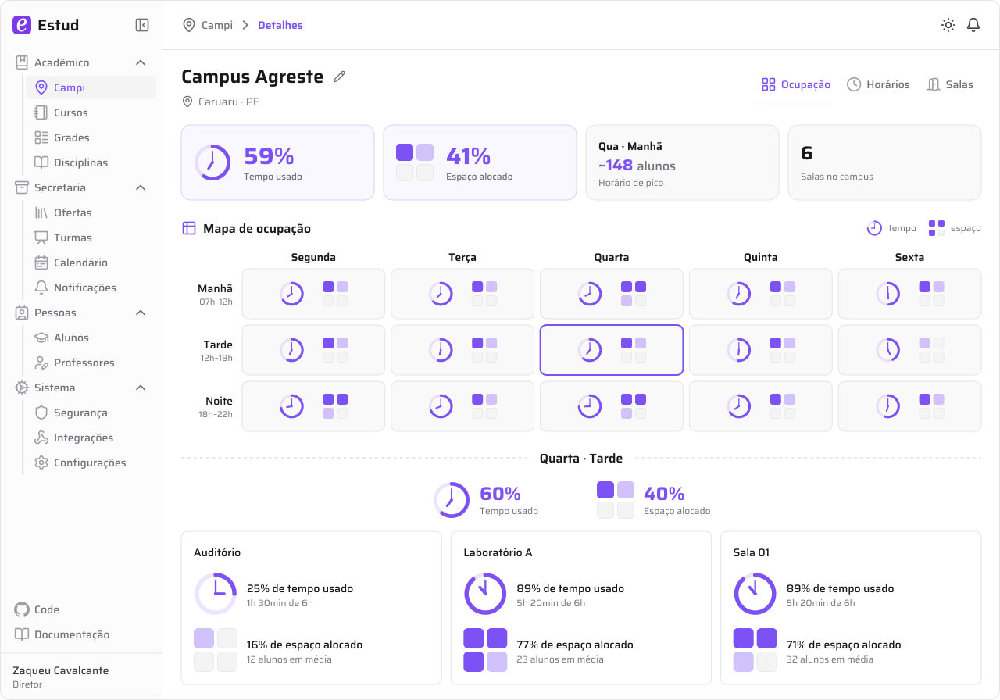

# Estud

O **Estud** é um sistema open-source para gerenciamento educacional, que pode ser usado por gestores, professores, alunos e responsáveis.

Cadastre sua instituição de ensino em https://estud.com.br e teste o sistema em produção!

<picture>
  <source media="(prefers-color-scheme: dark)" srcset=".github/assets/campus-dark.svg">
  
</picture>
